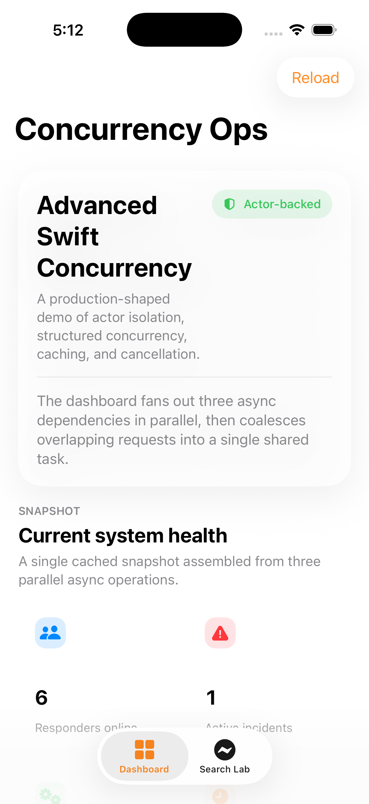
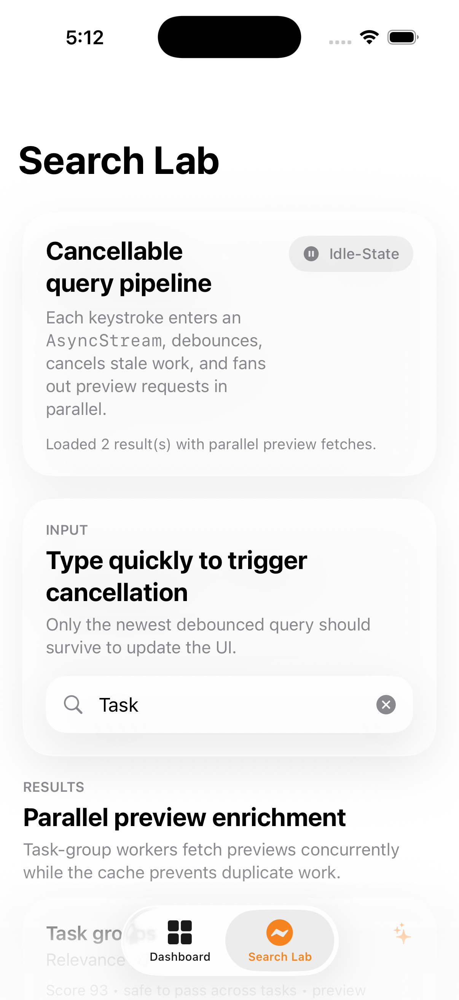
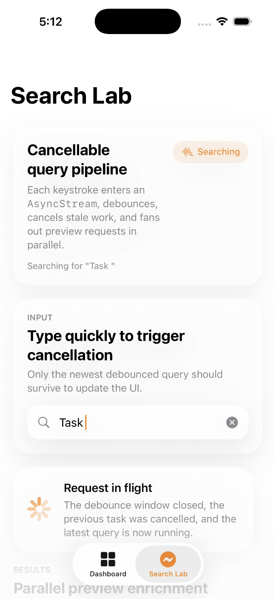

# Concurrency Architecture App

  
  
  
  

An open-source SwiftUI sample app that makes **advanced Swift concurrency** easy to see, explain, and reuse.

If you are learning Swift concurrency, preparing for iOS interviews, teaching structured concurrency, or looking for a clean demo of `actor`, `AsyncStream`, task groups, caching, and cancellation in one place, this repo is for you.

## Demo

Add your screenshots and recordings under `docs/media/` with the following filenames:

- `dashboard.png`
- `search-lab.png`
- `search-loading.png`
- `quick-demo.gif`
- `demo.mp4`

Once those files are present, this section will render nicely on GitHub:

  
  
  

  

Full video walkthrough: [Watch the video demo](docs/media/demo.mov)

### What the demo shows

- Actor-isolated repositories managing shared mutable state safely
- Structured concurrency with `async let` for parallel dashboard loading
- Debounced and cancellable live search powered by `AsyncStream`
- Task-group based parallel preview enrichment with actor-backed caching

## Why people find this useful

- It shows multiple real Swift concurrency patterns in one small app instead of isolated snippets.
- The architecture is simple enough to study quickly but realistic enough to adapt into production code.
- The UI makes concurrency states visible, which helps in demos, blog posts, interviews, and learning sessions.
- The repository is intentionally documentation-friendly, so it is easy to walk through with a team.

## Who this repo is for

- iOS engineers learning modern Swift concurrency
- Developers preparing for senior iOS or platform interviews
- Content creators making SwiftUI or concurrency tutorials
- Teams that want a lightweight reference implementation for actor-based architecture

## Architecture at a glance

The app is intentionally split into three layers:

- SwiftUI views render state and animate between loading, success, and empty states.
- `@MainActor` view models translate user intent into tasks and keep UI mutation serialized.
- `actor` repositories own mutable shared state such as caches and in-flight requests.

That split keeps the concurrency story easy to explain:

- views stay declarative
- view models coordinate cancellation and presentation state
- repositories encapsulate parallel work and shared mutable state

## What it demonstrates

- `actor`-isolated repositories for mutable shared state.
- In-flight request coalescing so duplicate dashboard loads share one task.
- Structured fan-out and fan-in with `async let` and task groups.
- A cancellable `AsyncStream` query pipeline for debounced live search.
- `Sendable` models flowing cleanly across concurrent boundaries.
- `@MainActor` observable view models that keep UI updates serialized.

## Why this architecture is interesting

Many sample apps stop at `async/await`. This one goes further:

- shared mutable state is isolated behind actors
- duplicated work is prevented with in-flight task coalescing
- user input is bridged into async workflows through `AsyncStream`
- search enrichment runs in parallel while still keeping UI updates deterministic

That combination makes the project useful both as a teaching artifact and as a starter reference.

## App tour

### Dashboard

The dashboard uses `DashboardRepository` to fetch three independent data sources in parallel. The repository caches the last successful snapshot and reuses an in-flight task when multiple callers ask for the same data at once.

Use this screen to discuss:

- `async let` for fan-out / fan-in
- actor isolation for shared mutable cache state
- cancellation at the view-model boundary
- keeping all UI mutation on the main actor

### Search Lab

The search screen pushes text input through a `QueryChannel` built on `AsyncStream`. Each new query cancels the previous request, waits for a debounce window, then performs the search. Result enrichment uses a task group to fetch previews in parallel while an actor-backed cache avoids duplicate preview work.

Use this screen to discuss:

- cancellation propagation
- `AsyncStream` as a bridge from UI events into async workflows
- `withThrowingTaskGroup` for parallel enrichment
- actor-backed caches that remain safe under concurrent access

## Teaching notes

If you are demoing this project live, a good walkthrough order is:

1. Start in `DashboardViewModel` and show that the UI launches a single task per intent.
2. Open `DashboardRepository` and point out cached state plus in-flight request coalescing.
3. Move to `SearchViewModel` to show debouncing and cancellation.
4. Finish in `SearchRepository` to explain task groups and actor-backed caching.

## Quick start

1. Clone the repository
2. Open `ConcurrencyArchitectureApp.xcodeproj` in Xcode
3. Run the `ConcurrencyArchitectureApp` scheme on an iPhone simulator
4. Pull to refresh the dashboard
5. Type quickly in Search Lab to see cancellation and debounced async search

## Recommended GitHub setup

For better discoverability, check [docs/GITHUB_SETUP.md](docs/GITHUB_SETUP.md) after pushing:

- a stronger repository description
- recommended GitHub topics
- social preview image guidance
- lightweight promotion ideas for sharing the project

## Key files

- `ConcurrencyArchitectureApp/Services/DashboardRepository.swift`
- `ConcurrencyArchitectureApp/Services/SearchRepository.swift`
- `ConcurrencyArchitectureApp/Services/QueryChannel.swift`
- `ConcurrencyArchitectureApp/ViewModels/DashboardViewModel.swift`
- `ConcurrencyArchitectureApp/ViewModels/SearchViewModel.swift`

## Running it

1. Open `ConcurrencyArchitectureApp.xcodeproj` in Xcode.
2. Run the `ConcurrencyArchitectureApp` scheme on an iPhone simulator.
3. Pull to refresh the dashboard and type quickly in Search Lab to see cancellation and debouncing in action.
4. Open the source side-by-side with the running app to connect each interaction to the concurrency mechanism behind it.

## Contributing

Contributions are welcome. If you want to improve the UI, add more concurrency demos, strengthen tests, or improve the teaching material, see [CONTRIBUTING.md](CONTRIBUTING.md).

## Tests

`ConcurrencyArchitectureAppTests` verifies two of the most important concurrency guarantees:

- dashboard requests are coalesced
- preview fetches are cached across searches
